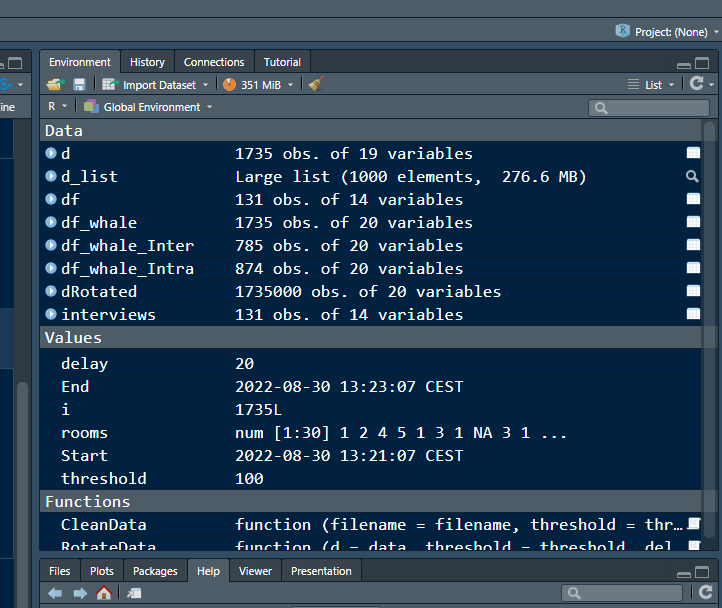
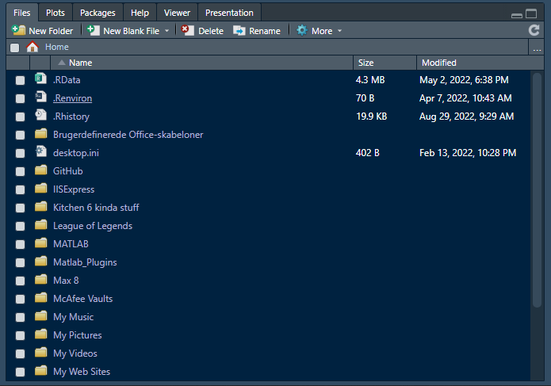

```{r}
library(tidyverse)
```

Instructions: For this assignment, you need to answer a couple questions with code and then take a screenshot of your working environment.
Submit the solutions including the URL to the screenshot in a doc/pdf to Brightspace.

1) Use R to figure out how many elements in the vector below are greater than 2 and then tell me what their sum (of the larger than 2 elements) is.
rooms <- c(1, 2, 4, 5, 1, 3, 1, NA, 3, 1, 3, 2, 1, NA, 1, 8, 3, 1, 4, NA, 1, 3, 1, 2, 1, 7, 1, 9, 3, NA)

```{r}
rooms <- c(1, 2, 4, 5, 1, 3, 1, NA, 3, 1, 3, 2, 1, NA, 1, 8, 3, 1, 4, NA, 1, 3, 1, 2, 1, 7, 1, 9, 3, NA)

c(rooms > 2, complete.cases(rooms))

rooms[rooms >2 & !is.na(rooms)] %>% 
  length()

rooms[rooms >2 & !is.na(rooms)] %>% 
  sum()

```


2) What type of data is in the 'rooms' vector?
```{r}
class(rooms)
```
More specifically integers. 

3) Submit the following image to Github: Inside your R Project (.Rproj), install the 'tidyverse' package and use the download.file() and read_csv() function to read the SAFI_clean.csv dataset into your R project as 'interviews' digital object (see instructions in https://datacarpentry.org/r-socialsci/setup.html and 'Starting with Data' section). Take a screenshot of your RStudio interface showing
a) the line of code you used to create the object,
```{r}
interviews <- read_csv("SAFI_clean.csv")
```

b) the 'interviews' object in the Environment, and


c) the file structure of your R project in the bottom right "Files" pane.
Save the screenshot as an image and put it in your AUID_lastname_firstname repository inside our Github organisation (github.com/Digital-Methods-HASS) or equivalent. Place here the URL leading to the screenshot in your repository.

4) Challenge: If you managed to create your own Danish king dataset, use it. If not, you the one attached to this assignment (it might need to be cleaned up a bit). Load the dataset into R as a tibble. Calculate the mean() and median() duration of rule over time and find the three monarchs ruling the longest. How many days did they rule (accounting for transition year?)

```{r}
#Easy Way
df_kings <- read_csv2("kings.csv", col_names = TRUE)
```


```{r}
#For fun way
df_kings <- read_csv("kings.csv", col_names = TRUE)

newnames <- strsplit(colnames(df_kings), split = ";")[[1]]

df_kings <- df_kings %>% 
  separate(colnames(df_kings)[1], newnames, sep = ";") %>%
  filter(Yearasruler != "Unknown") %>% 
  mutate_at(c("Start_date", "End_date", "Yearasruler"), as.numeric)
```
```{r}
summary(df_kings$Yearasruler)
```
```{r}
df_kings %>% 
  arrange(desc(Yearasruler))
```


```{r}
sort(df_kings$Yearasruler, TRUE)[1:3]
```

